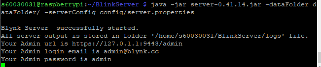
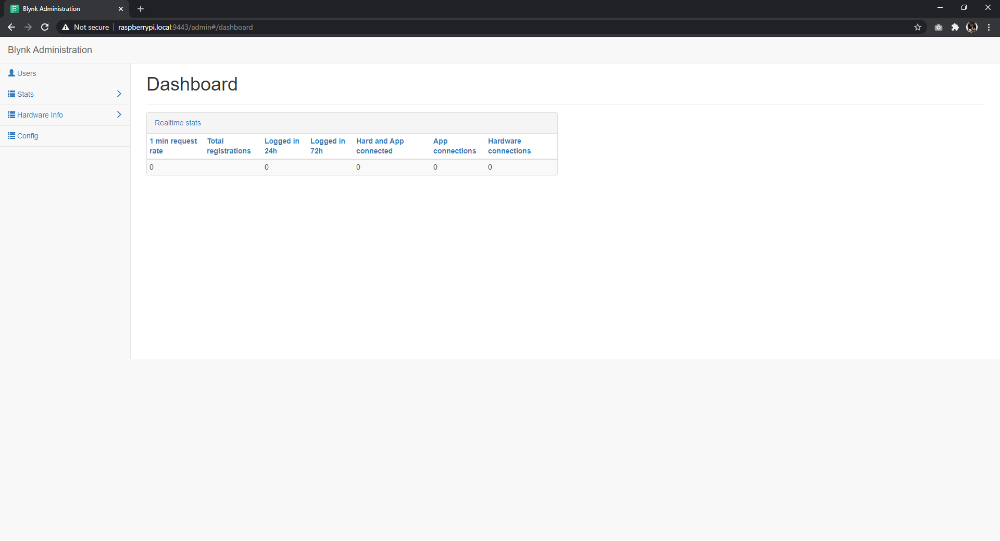
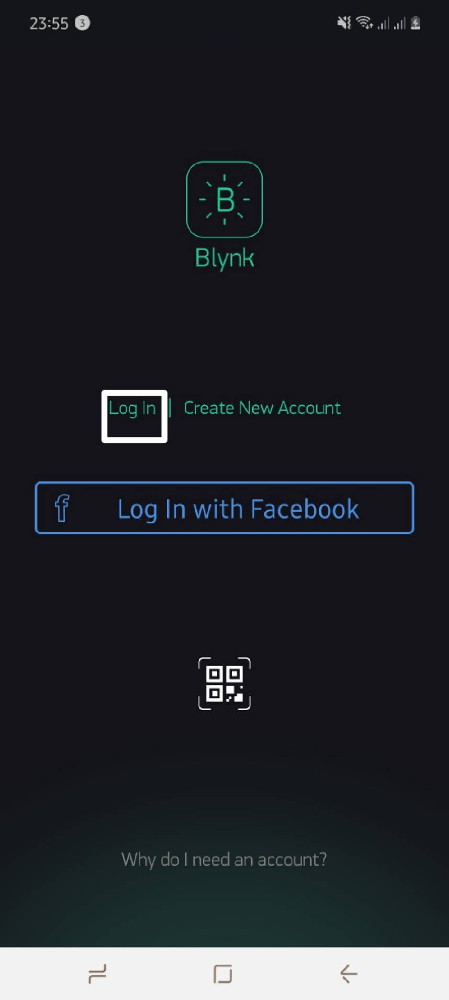
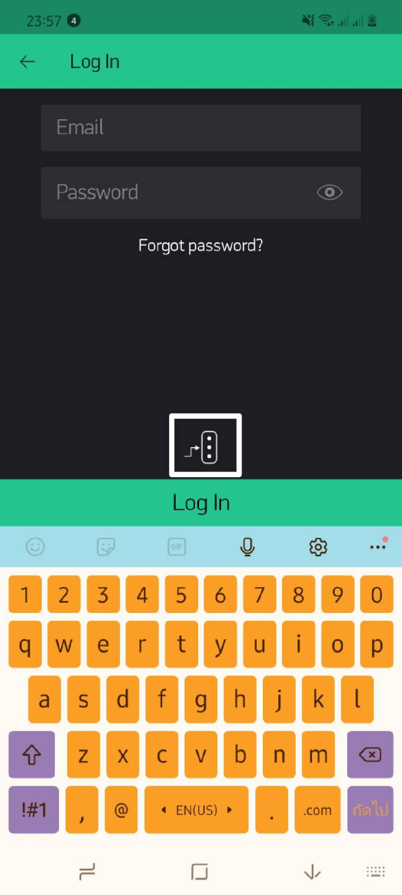
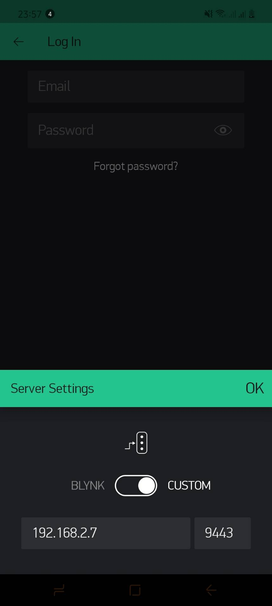
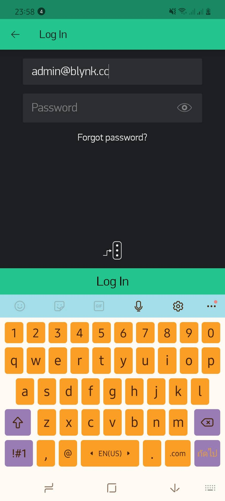
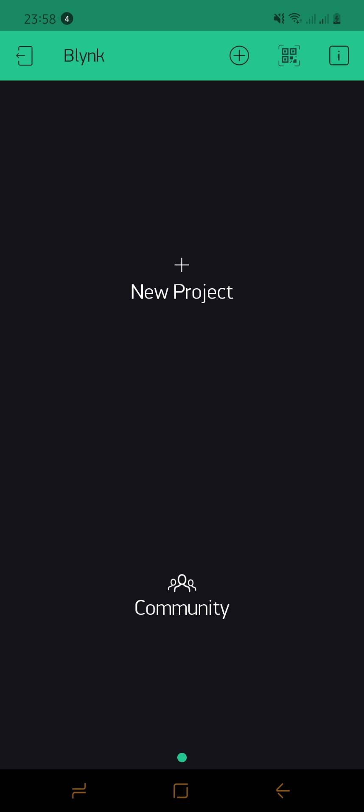

# การติดตั้ง Blynk Server บน RPi3
1. การติดตั้ง Java OpenJDK
2. การติดตั้งและใช้งาน Blynk Server

## การติดตั้ง Java OpenJDK
มี 2 เวอร์ชั่นให้เลือกใช้ ได้แก่ 
- เวอร์ชั่น 8 อันสามารถติดตั้งได้ด้วยคำสั่ง
```
    sudo apt update
    sudo apt install openjdk-8-jdk openjdk-8-jre
```
- เวอร์ชั่น 11 อันสามารถติดตั้งได้ด้วยคำสั่ง
```
    sudo apt update
    sudo apt install default-jdk
```

## การติดตั้งและใช้งาน Blynk Server
1. ทำการดาวน์โหลดไฟล์ server จาก github repository ซึ่งในที่นี้จะใช้คำสั่ง wget ในการดาวน์โหลด โดย
    - หากใช้ Java 8 ให้ใช้คำสั่ง
 ```        
     wget "https://github.com/blynkkk/blynk-server/releases/download/v0.41.14/server-0.41.14-java8.jar"
```
    - หากใช้ Java 11 ให้ใช้คำสั่ง
```
    wget "https://github.com/blynkkk/blynk-server/releases/download/v0.41.14/server-0.41.14.jar"
```
2. สร้างโฟลเดอร์เปล่าในการเก็บข้อมูลของ Blynk Server ซึ่งในที่นี้จะเก็บข้อมูลไว้ในโฟลเดอร์ dataFolder โดยใช้คำสั่งดังต่อไปนี้
```
    mkdir dataFolder
```
3. สร้างไฟล์ server.properties ในการเก็บ Config ของ Blynk Server ซึ่งในที่จะเก็บไว้ในโฟลเดอร์ config โดยใช้คำสั่ง
```
    nano config/server.properties
```
โดยมีข้อมูลดังต่อไปนี้
```
    admin.email=admin@blynk.cc
    admin.pass=admin
```
4. ทำการเปิดใช้งาน Blynk Server ด้วยคำสั่ง
```
    java -jar server-0.41.14.jar -dataFolder dataFolder/ -serverConfig config/server.properties
```
จะปรากฎข้อความดังต่อไปนี้



5. ทดลองเข้าใช้งาน Blynk Server 
    1. ผ่านหน้าเว็บไซต์โดยไปยัง URL
        ```
            https://raspberrypi.local:9443
        ```
        จะปรากฎหน้าเว็บดังรูป

        

        เข้าสู่ระบบโดยใช้ข้อมูลดังต่อไปนี้
        ```
            Email address : admin@blynk.cc
            Password : admin
        ```
        โดยข้อมูลนี้เป็นข้อมูลเดียวกันกับข้อ 3. 
        แต่หากไม่ได้ดำเนินการตามข้อ 3. แล้ว 
        ระบบจะทำการสุ่ม Password ขึ้นมา อันจะแสดงผลในขั้นตอนที่ 4.

        เมื่อเข้าสู่หน้าเว็บแล้วจะปรากฎหน้าเว็บดังต่อไปนี้

        
        
    2. ผ่าน Mobile Application
        1. เข้า Application Blynk เลือก Login
        

        2. เลือก Custom Server ดังรูป
        

        3. กรอก hostname และ port ดังรูป
        

        4. กรอก Email และ Password ดังรูป
        

        5. ปรากฎหน้าต่าง Dashboard อันหมายความว่า Server สามารถใช้งานได้ ดังรูป
        